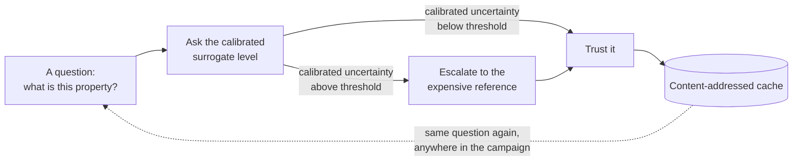
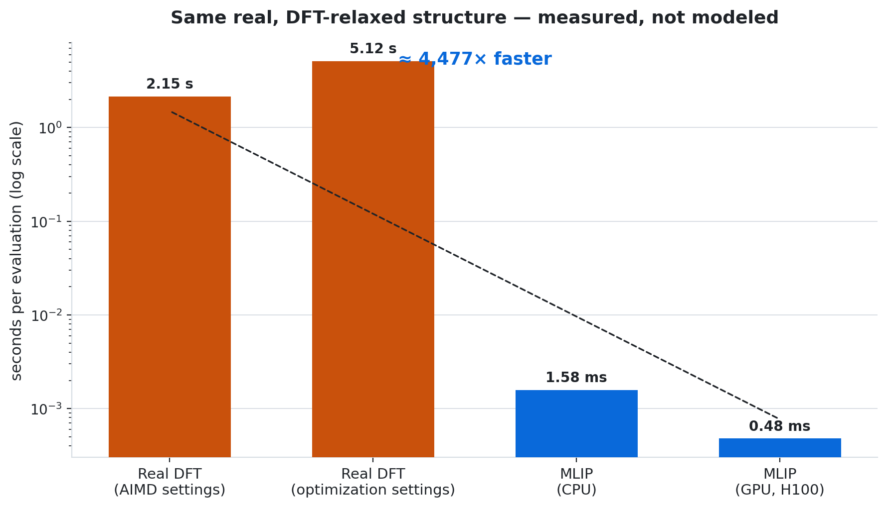
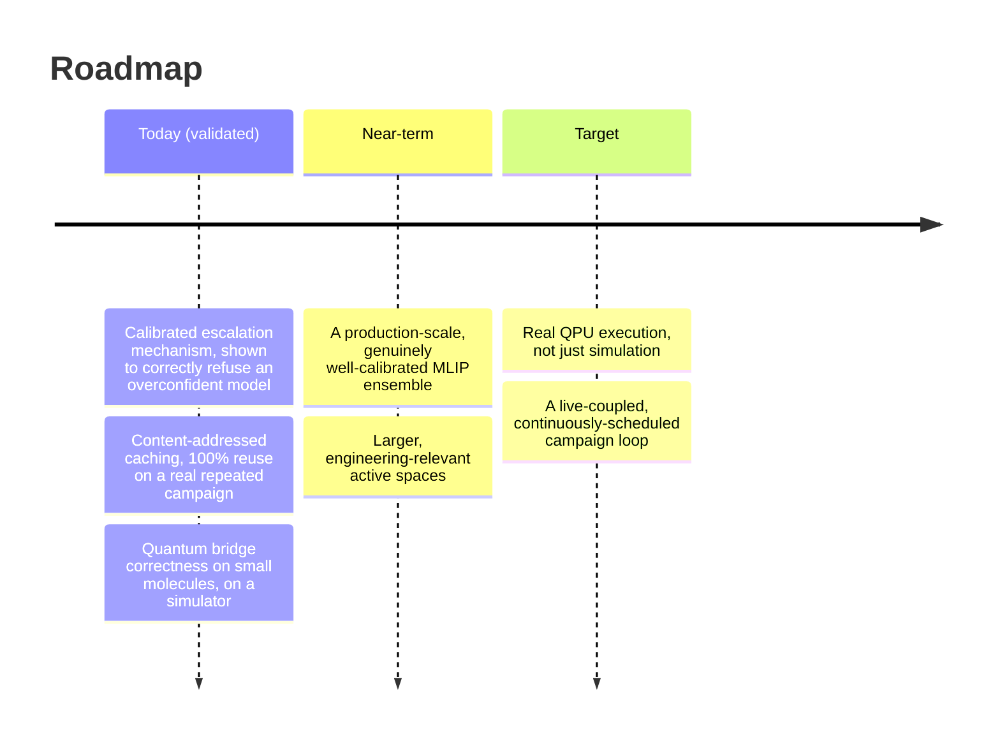

# qpu4qc: bridging quantum chemistry and quantum hardware for real-world engineering

*A report on an architecture for treating DFT, machine-learned interatomic
potentials, and quantum-hardware-computed active-space energies as one
priced, cached, calibrated computation — and what it takes to get from
there to giving engineering decisions access to chemistry at reaction
timescales.*

## Abstract

Computational chemistry has three tools for finding out what a molecule or
material will actually do: density functional theory (accurate, slow),
machine-learned interatomic potentials (fast, only as trustworthy as their
calibration), and quantum computers (exact for the strongly-correlated
problems the other two approximate, not yet at engineering scale). Real
engineering decisions — screening a battery electrolyte, designing a
catalyst — need all three, used in the right proportion, automatically, and
fast enough to sit inside a design loop rather than outside it. This report
describes an architecture for that: a content-addressed computation graph
in which DFT, an MLIP, and a quantum solver are interchangeable *levels* of
the same question, an ensemble's own reported uncertainty decides when the
cheap answer is trustworthy, and every result is computed once and reused
everywhere. We report real, measured results validating each piece, and are
explicit about what remains — the actual bridge to real quantum hardware
and true reaction-timescale operation — as ongoing work, not an implied
finished product.

## 1. The gap

Three facts about the current state of computational chemistry infrastructure:

1. **DFT is accurate and slow.** A single well-converged calculation on a
   modest solid-state system costs seconds to minutes; a molecular dynamics
   trajectory or a materials screen needs thousands to millions of such
   calculations. This is the classical bottleneck the entire MLIP field
   exists to work around. It's not an implementation inefficiency — a
   Kohn–Sham self-consistent-field calculation formally scales roughly
   O(N³) with system size (worse, up to O(N⁴), for hybrid functionals using
   exact exchange), because each SCF iteration is itself an eigenvalue
   problem over the whole system. That scaling is the real floor under
   DFT's wall-clock cost, not something a faster implementation fixes away.
2. **MLIPs are fast and only as trustworthy as their calibration.** A
   machine-learned potential can evaluate a structure in well under a
   millisecond — but a wrong, confident answer is worse than a slow,
   correct one, and knowing *which* is which requires a real, checked
   uncertainty estimate, not an assumed one. The reason an MLIP can be fast
   at all is a real physical assumption, not just a modeling trick: Kohn's
   "nearsightedness of electronic matter" — that an atom's local
   environment determines its energy contribution to good approximation —
   is what lets a local, equivariant model map atomic environments to
   energies and forces in O(N) time instead of solving the whole system's
   electronic structure. It's also exactly where that assumption can
   quietly fail: an environment far from anything the model has seen is
   where the fast answer is least trustworthy, which is the whole reason
   calibrated escalation exists rather than blind trust in the surrogate.
3. **Quantum computers are exact for the problems classical methods
   approximate, and not yet at engineering scale.** A strongly-correlated
   active space — the electronic structure a single-determinant classical
   method gets qualitatively wrong — is exactly the problem a variational
   quantum eigensolver is suited to. Today that means small molecules on
   simulators or early hardware, not full engineering-scale systems. This
   is a genuine complexity-class distinction, not a maturity gap that time
   alone closes — see §2's "why quantum specifically" for the actual
   argument.

None of these three, alone, gets a real engineering decision made at the
speed a design loop needs. The gap is not any one of them — it's that they
don't compose: there is no common infrastructure layer that treats a DFT
calculation, an MLIP evaluation, and a quantum circuit execution as
interchangeable, cost-accounted, cached options for answering the same
question, and decides automatically which one a given moment calls for.

## 2. The architecture

The core idea, in full detail in
[`architecture/level_abstraction.md`](architecture/level_abstraction.md):

- **A `Level` is anything that answers "what is this property, for this
  input" and optionally reports its own uncertainty.** A DFT calculation, an
  MLIP ensemble, and a quantum active-space solver all implement the same
  contract. Code built on top of a level — a relaxation, a
  transition-state search, a rate calculation — does not need to know or
  care which kind of level it's calling.
- **Content addressing.** Every result is hashed by everything that could
  change it: the structure, the level, every convergence parameter, every
  seed. The same question asked twice — in the same run, in a later run, by
  a different part of a campaign — is computed once.
- **Calibrated escalation.** A surrogate's raw reported uncertainty is not
  automatically meaningful. It is checked against a labelled reference set
  before being trusted at all, and refused outright if it carries no real
  signal about the surrogate's own error. Only a calibrated surrogate is
  allowed to decide, automatically, when its answer is good enough and when
  to pay for an expensive one instead.
- **A quantum level composes into the same graph.** It is not a wholesale
  replacement for the classical levels, and (being a single deterministic
  circuit execution, not an ensemble) it isn't gated by the same
  uncertainty-driven escalation logic — it's a third, independent source of
  ground truth for the specific sub-problem classical methods are least
  equipped for, priced and cached exactly like everything else in the
  graph.

```mermaid
quadrantChart
    title Where each level sits, and what escalation moves between
    x-axis Low cost --> High cost
    y-axis Approximate --> Trusted
    quadrant-1 Worth it only for the hardest sub-problems
    quadrant-2 The trusted fallback
    quadrant-3 The default first pass
    quadrant-4 Not a place any real level sits
    MLIP (calibrated): [0.12, 0.45]
    DFT reference: [0.78, 0.88]
    Quantum (active space): [0.55, 0.93]
```

**Why an ensemble's disagreement is a real signal, not a guess.**
Independently-seeded ensemble members are a practical approximation to a
Bayesian posterior over model parameters: on an input close to what they
were trained on, members agree; on an unfamiliar one, they diverge — and
that divergence is the standard way epistemic uncertainty is estimated in
the deep-ensemble literature. Calibration is exactly what it sounds like,
statistically: fitting a mapping from "how much the ensemble disagrees" to
"how wrong the mean answer actually turns out to be" against a labelled
set — the same operation as calibrating any classifier's confidence score,
applied to a regression target instead.

**Why caching this way, specifically.** Addressing every result by
everything that could change it turns "has this been computed before" into
a hash lookup — the same principle underlying Git's own object store, or a
build system like Bazel or Nix. Reproducibility and provenance aren't a
second feature bolted onto that cache; they're the same mechanism, looked
at from a different angle.



### Why quantum specifically

This isn't a maturity gap that more classical compute closes — it's a
different complexity class. Representing a strongly-correlated
wavefunction in a classical basis needs, in the worst case, a number of
Slater determinants that grows combinatorially with active-space size
(on the order of C(2M, N) ways to place N electrons across M spatial
orbitals) — the same combinatorial wall Feynman's original argument for
quantum simulation was aimed at. A quantum computer's state space grows to
match that naturally, qubit by qubit, instead of combinatorially against
classical memory. A variational quantum eigensolver is the practical,
near-term way to make use of that: it approximates the correlated ground
state with a circuit whose parameter count grows only polynomially with
system size, trading exactness for something that can actually run on
today's hardware — which is exactly why "validated on small molecules
against a simulator" (§6) and "runs on an engineering-relevant active
space on real hardware" are two different, not-yet-equal claims.

## 3. Validation — measured, not asserted

Full numbers and methodology in [`benchmarks/results.md`](benchmarks/results.md).

<picture>
  <source media="(prefers-color-scheme: dark)" srcset="benchmarks/charts/speed_comparison_dark.png">
  
</picture>

Headline results:

- **Speed**: an MLIP evaluated on the exact same real, DFT-relaxed
  structure a completed production DFT job had already computed —
  **4,500× to 10,600× faster**, measured against that job's own recorded
  wall-clock, not a published or assumed DFT cost.
- **Calibration guard correctness**: an overconfident, single-model
  surrogate — wrong by a mean of 3.6 eV against real ab initio data, while
  reporting exactly zero uncertainty about it — is **automatically refused**
  certification, rather than silently trusted.
- **Caching**: a real, multi-step property calculation, repeated against
  its own store, achieves a 100% cache hit rate and identical results to
  full numerical precision at zero additional wall-clock cost.
- **Quantum bridge correctness**: a simulated variational quantum
  eigensolver agrees with exact diagonalization to **5.7 × 10⁻¹¹ Hartree**
  on a real molecular system, composed into the same graph, cache, and cost
  accounting as the classical levels above.

## 4. Case study: a real materials engineering question

A lithium-vacancy migration barrier — the property that determines how fast
ions move through a solid electrolyte, and therefore how fast a battery can
charge — computed end to end through the architecture: build the vacancy,
relax both endpoints, find the transition state, compute the vibrational
prefactor, and turn a barrier height into a real hop rate at a given
temperature. Run once on real GPU hardware: tens of seconds. Run again
against the same store: instant, bit-identical. This is the shape of the
actual claim — not "faster DFT" in the abstract, but a real property, from
a real structure, computed with full provenance and reused without
recomputation across however many times a campaign needs to ask about it.

## 5. Toward real-time

The architecture as validated here answers questions on demand,
cached and calibrated. **"Real-time chemical reactions"** — the further
target — means closing the loop: a live campaign that re-evaluates its own
escalation decisions as new data arrives mid-trajectory, potentially coupled
to an in-flight molecular dynamics run or an experimental feedback signal,
rather than a batch of independent queries answered one at a time. That is
explicitly **not** what is demonstrated here yet. What is demonstrated is
the substrate it would be built on: a graph where a cheap classical answer,
an expensive classical answer, and an exact quantum answer are already
interchangeable, already priced, and already cached — the pieces a
real-time loop would schedule across, not yet the scheduler that runs
continuously against a live process.

## 6. What's not solved yet — stated plainly



- The quantum bridge is validated on small molecules (H₂, LiH) against
  simulators, not on an engineering-relevant active space, and not on real
  (noisy) quantum hardware.
- The calibrated-escalation mechanism is validated on synthetic ensembles
  and shown to correctly *refuse* an under-specified real model; a
  genuinely well-calibrated ensemble against real DFT data, at production
  scale, is still training.
- The "real-time," continuously-scheduled version of the campaign loop
  described in §5 does not exist yet — today's system answers queries, it
  does not yet run continuously against a live trajectory.

These are named here as the actual roadmap, not as caveats to a claim of
completeness.

## 7. What this repository contains

- This whitepaper, and [`architecture/level_abstraction.md`](architecture/level_abstraction.md)
  describing the interface contract and design in full.
- [`benchmarks/`](benchmarks/) — the real measured results above, with
  methodology.
- [`toy_demo/`](toy_demo/) — a small, dependency-free (numpy only), fully
  runnable reference implementation proving the pattern itself: caching,
  calibrated escalation, and a quantum-level stand-in, all in one file you
  can read in a few minutes and run in under a second.

What it does **not** contain: the production DFT/MLIP/quantum-hardware
adapters, the tuned calibration thresholds, or the full operation library
the real system runs on. See
[`architecture/level_abstraction.md#what-this-repo-shows-vs-what-it-doesnt`](architecture/level_abstraction.md#what-this-repo-shows-vs-what-it-doesnt).

## 8. Where this goes, and who it's for

The near-term roadmap is, in order: real QPU execution (not just
simulation) for the quantum level; a production-scale, genuinely
well-calibrated MLIP ensemble; and the live-coupled campaign loop that
makes "real-time" literal rather than aspirational. If you've shipped real
HPC or ML infrastructure, or work on quantum chemistry, quantum hardware, or
computational materials science, and this direction is one you'd want to
build rather than just read about — the contact information in
[`README.md`](README.md) is genuine.
