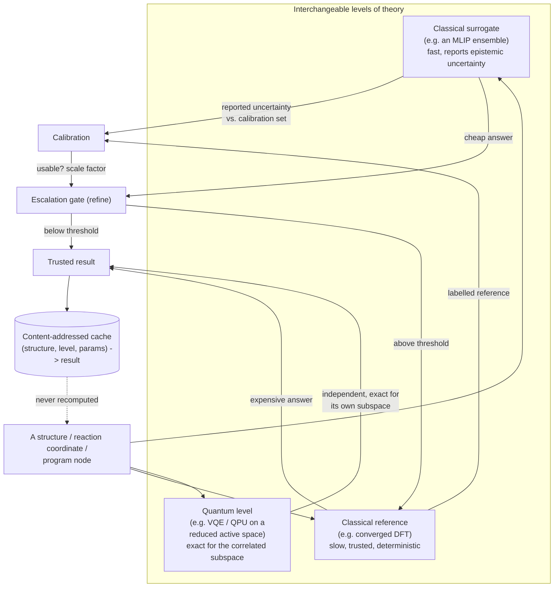

# The Level abstraction

The core architectural idea: every source of a physical property — a DFT
calculation, a machine-learned interatomic potential (MLIP), or a
quantum-hardware-computed active-space energy — implements the same
minimal interface, so a computation graph can name a system and a *level of
theory* separately from *how* that level is actually evaluated.



## The interface every level implements

Conceptually — not the real production signature, which also carries
structure geometry, convergence parameters, and physical units as part of
the content address:

```
Level.evaluate(input) -> (value, uncertainty | None)
```

- **`value`**: the property (e.g. an energy).
- **`uncertainty`**: `None` for a single deterministic calculation (it
  cannot honestly report how wrong it might be); a real number for an
  ensemble or a model explicitly designed to report epistemic spread.

Three concrete kinds of level satisfy this same contract:

| Level kind | Cost | Reports its own uncertainty? | Role |
|---|---|---|---|
| Classical surrogate (MLIP ensemble) | cheap | yes, from ensemble disagreement | first pass over every candidate |
| Classical reference (DFT) | expensive | no (a single converged answer) | ground truth for calibration and escalation |
| Quantum (QPU / VQE on an active space) | moderate–expensive, scales with active-space size | no (a single circuit's answer) | exact for the strongly-correlated subspace classical methods approximate |

## Calibration and escalation

A surrogate's raw reported spread is not automatically trustworthy — it can
be too small, too large, or (worst case) carry no real correlation with its
actual error at all. **Calibration** checks that correlation against a
labelled set drawn from the reference level before anything is allowed to
act on it, and refuses outright if the check fails. Only a calibrated
surrogate is allowed to drive **escalation**: trust the cheap answer where
its calibrated uncertainty is low, pay for the expensive one only where it
isn't.

This is the mechanism that makes "bridging quantum chemistry and quantum
hardware" more than a slogan: the quantum level isn't a wholesale
replacement for the classical ones, and it isn't gated by the same
uncertainty-driven escalation (a single circuit execution is deterministic,
not an ensemble) — it's a third, independent source of ground truth for
exactly the sub-problem (a strongly-correlated active space) that classical
methods are least equipped to get right, composed into the same graph, the
same cache, and the same cost accounting as everything else.

## Content addressing

Every result is addressed by everything that could change it — the input,
the level, and every parameter of that level (a DFT convergence setting, a
qubit mapping, an ensemble's seed). Two requests that hash to the same
address are the same computation, and are only ever paid for once — within
a run, across runs, and across an entire campaign. See
[`../toy_demo/qpu4qc_toy/cache.py`](../toy_demo/qpu4qc_toy/cache.py) for a
minimal, checkable version of this property; the production system extends
the same idea to real structures, real DFT convergence parameters, and real
quantum circuit configurations.

## What this repo shows vs. what it doesn't

This repository publishes the architecture, the interface contracts, real
measured benchmark results (see [`../benchmarks/`](../benchmarks/)), and a
small toy reference implementation that proves the pattern is real and
checkable. It does **not** publish the production adapters (the real DFT,
MLIP, and quantum-hardware integration code), the calibration guard's tuned
thresholds, or the full operation library the production system runs on —
those remain private.
